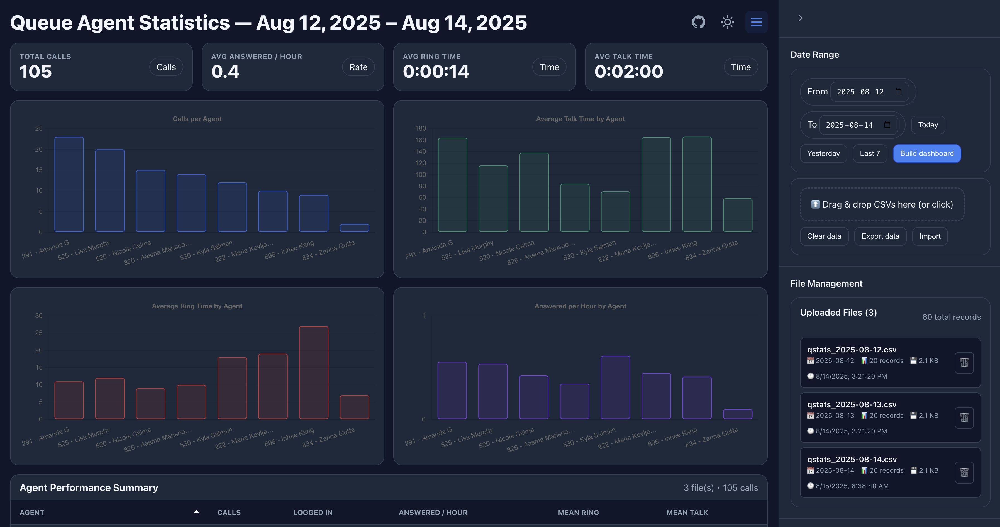

# 📞 3CX Call Reports Dashboard

[](https://opensource.org/licenses/MIT)
[](https://github.com/RAHB-REALTORS-Association/3cx-reports/actions/workflows/ci.yml)
[](https://nodejs.org/)

A comprehensive web application for analyzing and visualizing 3CX call system data. Upload CSV reports and get instant insights into call patterns, agent performance, and key metrics through interactive charts and detailed analytics.



## ✨ Key Features

* **Drag & Drop CSV Upload** — Easily import your 3CX call reports
* **Interactive Visualizations** — Includes:
  * Bar charts for call volume analysis
  * KPI grids for quick metrics overview
  * Agent performance tables
* **Dynamic Filtering** — Filter data by:
  * Date ranges
  * Queue selection
  * Agent performance
* **Real-time Analytics** — Instant calculations for:
  * Call volumes
  * Average call duration
  * Agent statistics
* **Responsive Design** — Works seamlessly across desktop, tablet, and mobile devices
* **Dark Mode Support** — Toggle between light and dark themes for comfortable viewing
* **Advanced File Management** — Upload multiple CSV files with:
  * Duplicate detection and prevention
  * Overlap and conflict detection for date ranges
  * Individual file deletion capabilities
* **Collapsible Sidebar** — Clean, organized interface with all controls in an intuitive sidebar
* **Data Integrity** — Smart validation and deduplication ensures accurate reporting

## 🚀 Getting Started

### Requirements

* Node.js v18+
* npm or yarn

### Installation Steps

1. **Clone the repository**

   ```bash
   git clone https://github.com/RAHB-REALTORS-Association/3cx-reports.git
   cd 3cx-reports
   ```

2. **Install dependencies**

   ```bash
   npm install
   ```

3. **Start the development server**

   ```bash
   npm start
   ```

4. Open your browser at [http://localhost:3000](http://localhost:3000)

### 🐳 Docker Deployment

You can also run the application using Docker:

1. **Build the Docker image**

   ```bash
   docker build -t 3cx-reports .
   ```

2. **Run the container**

   ```bash
   docker run -p 80:80 3cx-reports
   ```

3. Open your browser at [http://localhost](http://localhost)

## 🛠️ How to Use

1. **Upload Your Data**
   * Use the collapsible sidebar controls (hamburger menu in header)
   * Drag and drop your 3CX CSV report files into the upload zone
   * Supported formats: CSV files from 3CX queue agent statistics reports
   * Multiple files supported with smart duplicate detection

2. **Manage Your Files**
   * View all uploaded files in the File Manager section
   * See file details including date ranges, record counts, and upload times
   * Delete individual files as needed
   * System prevents duplicate uploads and detects overlapping data

3. **Build Your Dashboard**
   * Select date range for analysis
   * Click "Build Dashboard" to generate visualizations
   * Sidebar automatically closes to maximize dashboard viewing area

4. **Explore Your Data**
   * View agent performance metrics in the sortable table
   * Analyze call patterns with interactive bar charts
   * Monitor KPIs in the summary grid
   * Toggle dark/light mode for comfortable viewing

5. **Filter and Analyze**
   * Use queue filters to focus on specific queues
   * Apply agent filters to analyze individual or grouped performance
   * Adjust date ranges to compare different time periods

## 📊 Components Overview

### Core Components
* **Header** — Main navigation with dark mode toggle and sidebar controls
* **Sidebar** — Collapsible control panel containing all user interactions
* **Controls** — Date range selection and file upload interface
* **FileManager** — File management with upload history and deletion capabilities
* **Dropzone** — Drag-and-drop file upload with visual feedback

### Data Visualization
* **AgentTable** — Sortable table displaying agent performance metrics
* **BarChart** — Interactive bar charts for call volume visualization
* **ChartGrid** — Grid layout for multiple chart displays
* **KpiGrid** — Key performance indicators dashboard

### Filtering & Controls
* **QueueFilter** — Filter pills for queue selection and management
* **AgentFilter** — Filter pills for agent selection and management
* **DatePromptModal** — Date selection modal for files without date information

### Utility Components
* **Footer** — Application footer with additional information

## 🔧 Available Scripts

### `npm start`
Runs the app in development mode at [http://localhost:3000](http://localhost:3000)

### `npm test`
Launches the test runner in interactive watch mode

### `npm run build`
Builds the app for production to the `build` folder

## 🌍 Deployment Options

### Quick Deploy
[](https://vercel.com/new/clone?repository-url=https%3A%2F%2Fgithub.com%2FRAHB-REALTORS-Association%2F3cx-reports)
[](https://app.netlify.com/start/deploy?repository=https://github.com/RAHB-REALTORS-Association/3cx-reports)
[](https://heroku.com/deploy?template=https://github.com/RAHB-REALTORS-Association/3cx-reports)

### Manual Deployment
Deploy to any static hosting provider:

#### Vercel
```bash
npm install -g vercel
vercel --prod
```

#### Netlify
```bash
npm run build
# Drag the build folder to netlify.com/drop
```

#### GitHub Pages
1. Enable GitHub Pages in repository settings
2. Set source to GitHub Actions
3. Push to main branch (CI will auto-deploy)

#### AWS S3 + CloudFront
```bash
npm run build
aws s3 sync build/ s3://your-bucket-name --delete
aws cloudfront create-invalidation --distribution-id YOUR_DISTRIBUTION_ID --paths "/*"
```

#### Docker Deployment
```bash
docker build -t 3cx-reports .
docker run -p 80:80 3cx-reports
```

#### Traditional Web Server
```bash
npm run build
# Copy build/ contents to your web server directory
```

## 🤝 Contributing

Pull requests are welcome! For major changes, please open an issue first to discuss what you would like to change.

## 🙌 Built With

* **React 18** — Modern frontend framework with hooks and concurrent features
* **Create React App** — Zero-configuration build toolchain
* **Modern JavaScript (ES6+)** — Latest language features and syntax
* **CSS3 with CSS Variables** — Responsive styling with dark mode support
* **Local Storage API** — Client-side data persistence
* **File API** — Modern drag-and-drop file handling
* **Recharts** — Responsive chart library for data visualization

## 📄 License

This project is licensed under the MIT License. See the [LICENSE](LICENSE) file for details.
